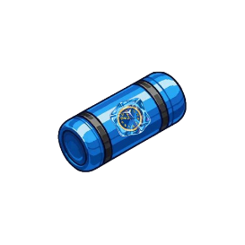

## ReiCIng: Reizinhos do Asfalto🏎️
Esse projeto consiste em um jogo de carro em 2D, na qual o objetivo é desviar de obstáculos a medida que a velocidade do automovél aumenta, enquanto isso o piloto deve pegar diversos coletáveis que vão ajuda-ló a se tornar o verdadeiro Reizinho do Asfalto, eai você tem o que é necessesário para vencer a ReiCIng?

## Autores📝

- Antonio Neto (agan)
- Caio Bagra (csb)
- Daniel Cavalcanti(dcms3)
- Felipe Mulato (fam3)
- Gabriel Mezzalira (gmtbn)
- Leonardo Alves (laco)

## Divisão de Tarefas🦾

| Membros           | Tarefas                                                         |
| ----------------- | ----------------------------------------------------------------|
| Antônio Neto      | Criação do coletável de diminuir velocidade                     |
| Caio Braga        | Menu inicial do jogo, Tela de game over                         |
| Daniel Cavalcanti | Criação de movimento da tela e do carro                         |
| Felipe Mulato     | Criação do obstáculo parede e funções internas do jogo          |
| Gabriel Mezzalira | Criação do coletável de recuperação de vida e da pontuação      |
| Leonardo Alves    | Criação do obstáculo espinho e das animações do jogo            |

## Como rodar o jogo 🧐
1º - Basta Ter o Python e o Pygame instalados em sua Máquina.

2º - Clonar este repositório ou baixar o arquivo zip.

3º - Abrir a pasta ReiCIng-Reizinhos-do-Asfalto um editor de código como VS CODE ou PyCharm

4º - Rodar o arquivo __main__.py.

## Controles🎮

| Atalhos          | Função                                                        |
| ---------------- | ------------------------------------------------------------- |
| SETA_UP/SETA_DOWN| Movimentação |

## Itens 🤖

| Coletável        | Função                                                        |
| ---------------- | ------------------------------------------------------------- |
| | Regenerar uma vida |
| | Desacelerar o carro    |
|| Pontuação do jogo |

## Bibliotecas e ferramentas📚

| Biblioteca          | Utilização                                                       |
| ---------------- | ------------------------------------------------------------- |
| PyGame |	A biblioteca pygame é a principal de nosso projeto, pois ela tem funções específicas que facilitam na criação do jogo, principalmente na questão da renderização de objetos e as interações entre eles.|
| Random |  A biblioteca "Random" foi utilizada em algumas partes do código, utilizando a função "Randint", que sorteia um número inteiro dentro de um intervalo definido, fizemos as mecânica para decidir qual coletável seria "dropado" apartir dela.|

## Conceitos 👨🏾‍🏫

É possível ver ao longo do código, aplicações de diversos conceitos ensinados durante o semestre. Nota-se com uma certa frequência o uso de Comandos condicionais, Laços de repetição, Listas, Tuplas, Funções e principalmente, programação orientada a objeto.

## Organização do Código🧑🏾‍💻

O código foi estruturando usando o conceito de programação orientada a objetos. As classes importantes foram:

- Carro(): Classe responsável por armazenar os dados e as funções ralacionadas ao player.
- Espinho(): Classe responsável por armazenar os dados e as funções relacionadas aos espinhos.
- Parede(): Classe responsável por armazenar os dados e as funções relacionadas as paredes.
- Sons(): Classe responsável pelos efeitos sonoros do jogo.
- Pista(): Classe responsável por armazernar as informaçãoes sobre a pista e movimentação da tela.
- Trofeu(): Classe responsável para armazenar as informações sobre o coletável da pontuação.
- Slow(): Classe responsável para armazenar as informações sobre o coletável de redução da velocidade.
- Vidas():Classe responsável para armazenar as informações sobre o coletável de recuperação da vida.
- Explosão(): Classe reponsável pela animação da explosão.
- HudTrofeu(): Classe reponsável pela animação do hud trofeu.

## Desafios e Experiências🎓

O principal desafio que enfrentamos durante a realização deste projeto foi aprender a utilizar ferramentas e conceitos que nunca havíamos visto antes, como a biblioteca Pygame e a programação orientada a objetos. No entanto, foi extremamente útil adquirir esses conhecimentos, pois eles nos permitiram realizar tarefas muito mais avançadas do que imaginávamos no início do curso.
Outro aprendizado importante que tivemos com este projeto foi o uso de plataformas como o GitHub que nos ajudaram a organizar o desenvolvimento de forma mais eficiente e colaborativa.
  
## Imagens📸

------------------------------------------------------------------------------------------------------------------------------------------

Está é a aba inicial. Nela pedemos utilizar o cursor ou o botão "enter" para dar continuidade ao jogo.

------------------------------------------------------------------------------------------------------------------------------------------

Abaixo está a tela de seleção dos carros. A escolha dos carros pode ser feita pelo cursor, pelos números (1, 2, 3, 4, 5), ou pelas setas. 
O game só dará start quando a tecla "enter" ou "space" forem acionadas, ou quando o cursor clicar no "press start". 

------------------------------------------------------------------------------------------------------------------------------------------

Fim da linha? Não, você pode clicar em "yes" para reiniciar o jogo, ou se estiver cansado, clique em "no" para dar uma pausa.

------------------------------------------------------------------------------------------------------------------------------------------

_______________________________________
|      Carros      |     Descrição    |
|------------------|------------------|
|  | *Máquina de Mistérios do Scooby-Doo*: Não é só um carro, é uma aventura ambulante! Com escorregadelas, curvas malucas e gadgets secretos, ela transforma cada obstáculo em um mistério que você vai querer desvendar… ou evitar! |
|  | *Mezzamóvel*: O lendário Doblo que conquistou corações! Antes de ser vendido, ele era mais que um carro: era uma lenda ambulante, idolatrado por todos que conheciam suas curvas e manobras. Agora ele volta às pistas para mostrar que, mesmo longe de casa, o espírito do Mezzamóvel nunca foi vendido! |
|  | *Porsche rosa da Professora Fernanda*: Elegância sobre quatro rodas! Com seu charme cor-de-rosa e habilidades de professora, ela ensina os obstáculos a não atravessarem seu caminho… mas cuidado, atrasar o tempo da aula pode custar caro! |
|  | *Relâmpago McQueen*: O astro veloz que não precisa de apresentação! Sempre acelerando e soltando piadinhas rápidas, ele quer cruzar a linha de chegada antes que os troféus percebam que ele chegou. |
|  | *Fiat Uno com escada no teto*: O mestre da improvisação! Pequeno, resistente e pronto para qualquer situação, sua escada permite ultrapassar obstáculos de um jeito que nenhum outro carro ousaria tentar. Simples, mas genial! |

------------------------------------------------------------------------------------------------------------------------------------------

